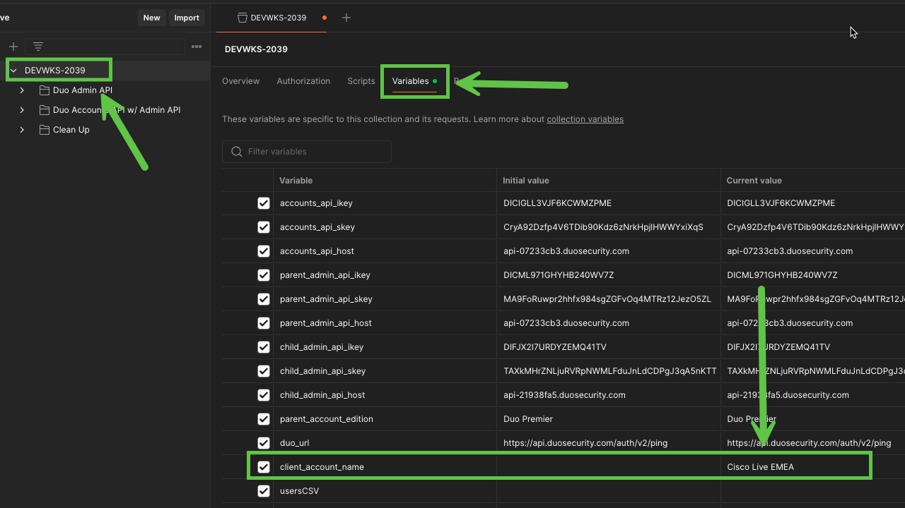
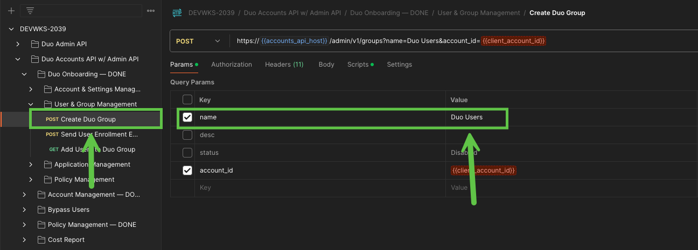
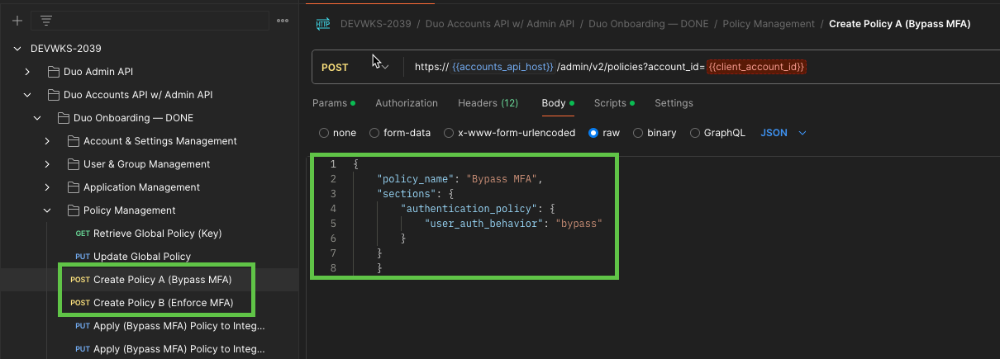
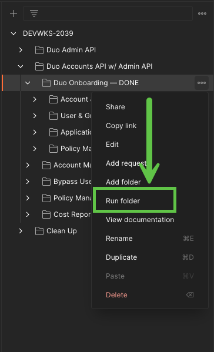
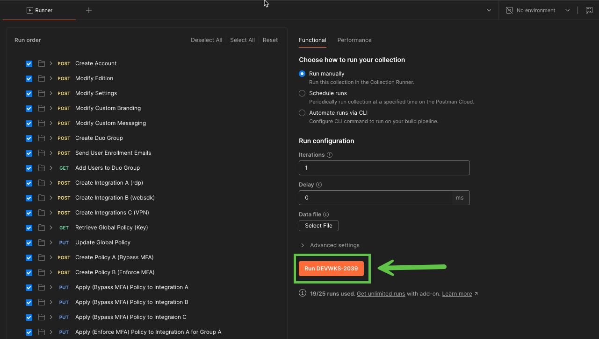
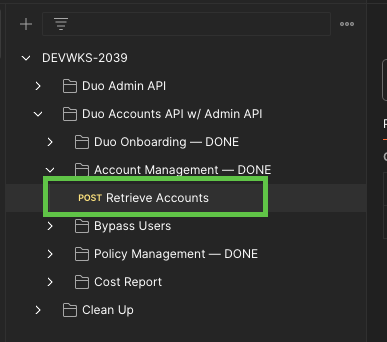

# Task 2: Onboard a New Duo Customer  

A new non-profit organization urgently needs to deploy Duo to secure their enterprise resources. The client has approximately 50 employees and requires robust security for remote and privileged access to their Cisco VPN, Windows endpoints, and a custom web application used to host sensitive donor data. Given the critical nature of their operations and the sensitivity of the data involved, they require this deployment to be completed today to satisfy cyber liability requirements. The client has requested to start with a pilot group of 10 users to ensure a smooth and secure rollout.  

## **1. Configure Account Details**  
**Navigate to the** **DEVWKS-2039** collection >> **Variables**  

1. Define the account name:  
   - In the **Current value** column of the `client_account_name` collection variable, enter the account name.  
   - If you are in **seat 2**, name the account `"DevNet.WS1.Seat2"`.  
2. Save the changes.  



**Navigate to the** **Duo Accounts API w/ Admin API** folder >> **Duo Onboarding** >> **Account & Settings Management** >> **Modify Edition**  

1. Set the Duo edition in the **Params** tab:  
   - Choose from **Duo Essentials**, **Duo Advantage**, or **Duo Premier**.  
   - Refer to the **Description** field for correct formatting.  
2. Save the changes. Click the **Send** button to execute the API call.  


## **2. Configure User and Group Details**  
Navigate to the **Duo Admin API** folder >> **User & Group Management** >> **Create Duo Group**  

1. Go to the **Params** tab and enter a name for the Duo group.  
   - Example: `Duo Users`.  
   - Note: Avoid special characters. 
2. Save the changes. Click the **Send** button to execute the API call.  



**Navigate to the** **DEVWKS-2039** collection >> **Variables**  

1. Copy and paste the following user details into the `usersCSV` variable:

    ```csv
    username,email
    Caleb Johnson,caleb.johnson@example.com
    Ava Richardson,ava.richardson@example.com
    Mason Bennett,mason.bennett@example.com
    Isabella Hayes,isabella.hayes@example.com
    Lucas Reed,lucas.reed@example.com
    Harper Foster,harper.foster@example.com
    Elijah Brooks,elijah.brooks@example.com
    Lily Sanders,lily.sanders@example.com
    Benjamin Ross,benjamin.ross@example.com
    Charlotte Gray,charlotte.gray@example.com
    ```
    
2. Save the changes.  


## **3. Configure Application Details**  
Navigate to the **Duo Admin API** folder >> **Application Management**  

1. On the **Params** tab of each request, define the application **Name** and **Type** as outlined below:  

- **Create Integration A**  
  - **Name**: `Duo Authentication for Windows Logon`
  - **Type**: `rdp`  

- **Create Integration B**  
  - **Name**: `Donor Database`  
  - **Type**: `websdk`  

- **Create Integration C**  
  - **Name**: `Cisco VPN`  
  - **Type**: `ciscoradius`  

2. Save the changes. Click the **Send** button to execute each API call.  


## **4. Configure Policy Details**  
Navigate to the **Duo Admin API** folder >> **Policy Management**  

1. On the **Body** tab of the **Create Policy A** and **Create Policy B** requests, define the policy details as outlined below:  

- **Create Policy A**  
  - **Policy Name**: `Bypass MFA`  
  - **User Authentication Behavior**: `bypass`  

- **Create Policy B**  
  - **Policy Name**: `Enforce MFA`  
  - **User Authentication Behavior**: `enforce`  

2. Save the changes. Click the **Send** button to execute each API call.




<details>
  <summary>Click to expand policy JSON if needed or continue to next step</summary>
  

  
{
    "policy_name": "Bypass MFA",
    "sections": {
        "authentication_policy": {
            "user_auth_behavior": "bypass" 
        }
    }
}

</details>

## **5. Deploy the New Duo Customer**  
Navigate to the **Duo Admin API** folder >> **Duo Onboarding**  

1. Hover over the **Duo Onboarding** folder. Click the three dots (**...**) to expand the menu, then select **Run Folder**.  
2. In the **Collection Runner**, click the **Run DEVWKS-2039** button.  





## **6. Verify the Deployment (Optional)**  
Navigate to the **Duo Admin API** folder >> **Account Management** >> **Retrieve Accounts**  

1. Click the **Send** button to execute the request.  
2. Verify that the Duo account you created appears in the list of child accounts.  




[Continue to Next Task](03_Set_Bypass_Code.md)  
