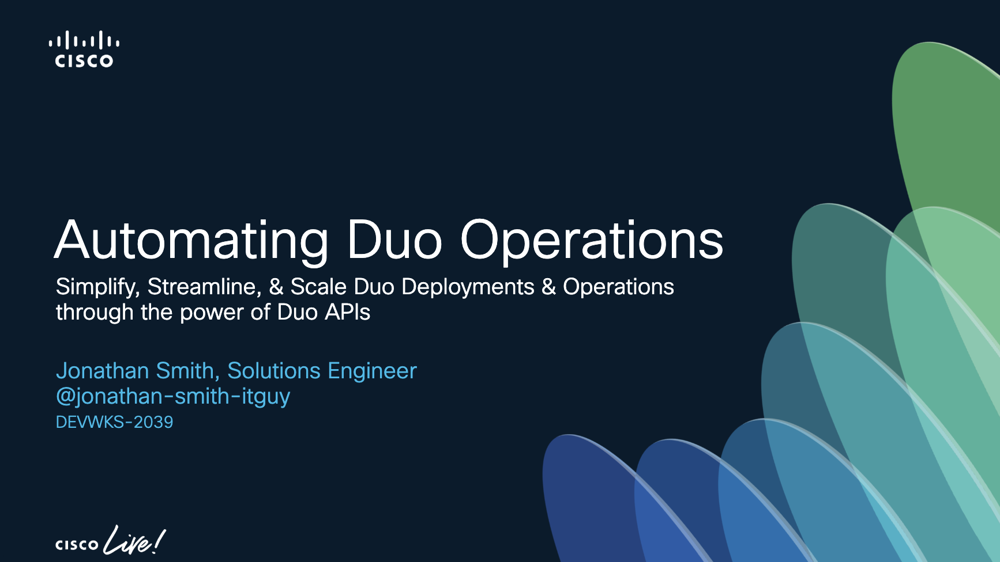

# Cisco Live EMEA 2025  
## DEVWKS-2039 - Automating Duo Operations for MSPs: Simplify, Streamline, & Scale Duo Deployments & Operations through the power of Duo APIs  

### Learning Objectives  

Upon completion of this lab, you will:  
- Gain clarity on Duo's core APIs, including the Accounts API and Admin API  
- Understand how Postman facilitates API interactions  
- Learn to optimize Duo operations and scale Duo deployments using the user-friendly Postman platform

---

---

## **Scenario**  

In today's fast-paced IT and security landscape, automation is essential for scalability. Managing Duo deployments and establishing efficient workflows for account creation, deployment, and management can quickly become complex.  

This lab explores how APIs can streamline Duo administrative tasks and enhance scalability. Using Postman, you'll perform key Duo operations to reduce manual effort, minimize errors, and improve efficiency. By the end, you'll understand how to leverage Postman to simplify Duo account management and security workflows.  

In this lab, we’ll explore the capabilities of Duo’s APIs by performing the following tasks using Postman:  

- **Create a New Duo User** – Quickly add a user to a Duo account.  
- **Onboard a Duo Client Account** – Use the Duo Accounts API to create a new client account, configure settings, set up integrations, apply policies, and import user data.  
- **Retrieve Bypass User Status** – Identify bypass users across multiple child accounts and update their status to active.  
- **Enforce Policies** – Apply Duo policies across multiple accounts simultaneously.  
- **Generate a Usage Report** – Pull cost reports for financial analysis.  

### **[Task 1: Add a Duo user](01_Add_Duo_User.md)**  

A new employee has joined the team, and they need access to Duo-protected applications. As an IT administrator, your task is to onboard the user by creating their Duo account, registering their phone, and linking the phone to their user profile. This ensures they can securely authenticate when accessing company resources.  

### **[Task 2: Onboard a New Duo Customer](02_Onboard_Duo_Customer.md)**  

We've onboarded a new non-profit organization that urgently needs to deploy Duo to secure their enterprise resources. The client has approximately 50 employees and requires robust security for remote and privileged access to their Cisco VPN, Windows endpoints, and a custom web application used to host sensitive donor data. Given the critical nature of their operations and the sensitivity of the data involved, they require this deployment to be completed today to satisfy cyber liability requirements. The client has requested to start with a pilot group of 10 users to ensure a smooth and secure rollout.  

### **[Task 3: Set a User to Bypass](03_Set_Bypass_Code.md)**  

As IT administrator, you often have the responsibility of assisting users with their access needs on the fly. In this task, you'll address a common scenario where the user you created earlier has left their mobile device at home and needs temporary access to company resources. Management has authorized providing the user with a bypass code to help them gain access to protected applications.

### **[Task 4: Retrieve Bypass User Status](04_Pull_Bypass_Report.md)**  

As an IT administrator, you may need to audit and review users who have bypass status enabled. This task will help you retrieve a report of all users currently in bypass mode across multiple Duo accounts. 

### **[Task 5: Enforce Security Policies](05_Enforce_Security_Policies.md)**  

A key aspect of Duo's security lies in its policy enforcement. As an IT administrator, there are times when you must apply specific policy settings across all child accounts to ensure uniformity and maintain a strong security posture. Following a recent security advisory, we have been instructed to disable SMS and phone call authentication as authentication factors across all child accounts and enforce Duo Verified Push for enhanced security. In this task, you'll enforce verified push authentication with an 8-digit verification code across all Duo client accounts to ensure consistent security.

### **[Task 6: Generate a Cost Report](06_Pull_Cost_Report.md)**  
 
Our organization's accounting department has requested a real-time usage report to identify the cost of Duo for all of our client accounts. They need details regarding the edition count and users of each edition. Use the request below to pull this data. 

## **Thank You for Participating!**  

If you've made it this far, congratulations—you've successfully completed this **DEVNET lab**! 🎉  

Thank you for following along. I hope you learned something new and found this session valuable.  

For continued learning, check out some of the **resources below**. Also, don't forget to complete your [Session Survey](images/workshop_survey.png) —your feedback is incredibly important!

If I did great, we'd love to know. And if you think I sucked, that’s fine too—let me know how I can improve!  

**Have a fantastic rest of your Cisco Live experience!** 🚀  

## [Continued Learning](images/continue_learning.png)

- [Cisco Duo API Learning Lab](https://developer.cisco.com/duo/)  
- [Duo API Playground](https://developer.cisco.com/codeexchange/github/repo/it-jonjon/Duo-API-Playground)
- [Accelerate and Automate with Duo APIs](https://duo.com/resources/webinars/accelerate-and-automate-with-duo-apis)  

